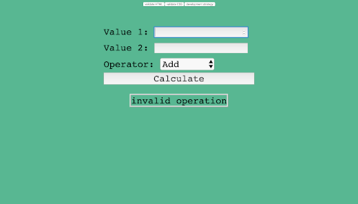

# Calculator-refactor. 

## Table of contents
* [General info](#general-info)
* [Screenshots](#screenshots)
* [Technologies](#technologies)
* [Setup](#setup)
* [Features](#features)
* [Status](#status)
* [Inspiration](#inspiration)
* [Contact](#contact)

## General info
The purpose of this project was learning how to use and how works Javascript in the web pages, building a calculator with the basic operations (add, minus, divide, multiply). This project was made using the Visual Studio Core for writing the code, and then I use GitKraken for save my code remotely in Github.
For be more organized I create different branches that show every step and change that I made.
Everything was building in a really friendly web page, that everyone can understand and use.

## Screenshots

## Technologies
* HTML 5.
* CSS.
* Javascript.

## Setup
Fork or clone this repository. 

## Features
*  The calculator.
* Javascript code for process the values , and calculate  them.

## Status
Project is: **_finished_.**

## Inspiration
Project inspired by [this tutorial](https://www.youtube.com/watch?v=qQEYAOPWDzk)
## Contact
Created by [@Elisa0045](https://github.com/Elisa0045) - feel free to contact me!
